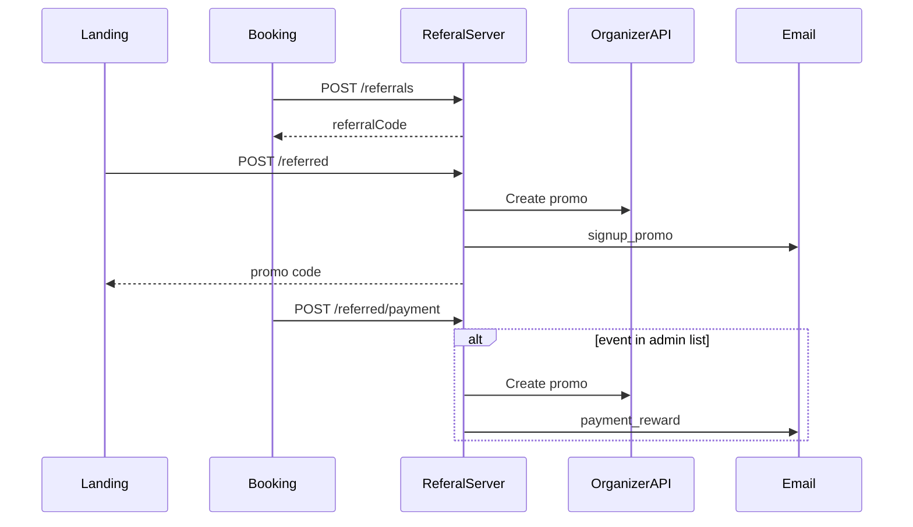

# Introduction

Referal.Server is the backend for Eventhub’s **loyalty / referral program**.
It registers referrers after ticket purchase, signs up referred friends from
the landing page, creates discount promos in Eventhub’s Organizer API, sends
transactional email, and exposes a built-in **admin CRM** for content,
events, and operations.

The service is designed to sit behind:

- **Static loyalty landing** (`landing/`) — signup with a referral link,
  promo display, terms, localized copy, and event cards.
- **Booking checkout** (`Booking.Front`) — register the buyer as a referrer,
  attach referred users at checkout, and notify the server when a referred
  friend completes a qualifying first purchase.

---

## Core concepts

| Concept | Description |
| -------- | ----------- |
| **Referral (referrer)** | A customer who bought a ticket and receives a unique `referralCode` to share. One row per email in `referrals`. |
| **Referred user** | Someone who joined via a referrer’s link and email. Stored in `referred`. |
| **Signup promo** | Discount code for the **referred** person, created when they submit email on the landing (`purpose: signup`). |
| **Payment reward promo** | Discount code for the **referrer**, created when the referred user completes a first purchase on an **eligible event** (`purpose: payment_reward`). |
| **Eligible events** | Events synced from Eventhub and marked selected in admin. Only purchases on these events trigger referrer rewards and `hasPayment = true`. |

Referral links use query params such as `?ref=CODE` (or `referralCode=`).
The landing and booking apps persist the code in a cookie for attribution.

---

## End-to-end flows

### 1. Referrer registration (after payment)

1. Customer pays on Booking.
2. Booking calls `POST /api/referrals` with `email`, `phone`, and `eventId`.
3. Server creates a referral row with a unique code (idempotent if email
   already exists).
4. UI shows share link and referral banner using that code.

### 2. Referred signup (landing)

1. Visitor opens loyalty URL with `?ref=CODE`.
2. Visitor submits email on the landing form.
3. Landing calls `POST /api/referred` with `email` and `referralCode`.
4. Server validates the code, creates an Eventhub promo, stores the referred
   user, sends **signup** email to the friend, returns promo code in JSON.
5. Landing shows the promo and links to events on the same page.

### 3. Referred first purchase (reward referrer)

1. Referred user buys a ticket on Booking (cookie still holds `ref`).
2. On successful payment, Booking calls `POST /api/referred/payment` with
   `email`, `referralCode`, `eventId`, and optional `phone` / `buyPrice`.
3. If `eventId` is in the admin event list, server sets `hasPayment`, creates
   a promo for the **referrer**, and sends **payment reward** email.
4. If the event is not in the list, payment is recorded without reward (no
   referrer promo, `hasPayment` stays false).

---

## Architecture

- **Runtime:** NestJS 11, TypeScript, Express.
- **Database:** PostgreSQL with Drizzle ORM; migrations in `drizzle/`.
- **Auth:** Cookie-based admin sessions (`admin_session`); public endpoints
  marked with `@Public()`.
- **External services:**
  - Eventhub **Website API** — event catalog for sync.
  - Eventhub **Organizer API** — promo creation (`/Promo/v2/Create`).
  - **Dinno email API** — HTML promo emails.
- **Configuration:** `.env` for secrets and API hosts; **Settings** in CRM for
  promo defaults (discount %, validity) and mailing (`from`, `bcc`, name).
- **Content:** Landing strings live in DB (`landing_content`), merged with
  defaults in `content.defaults.ts` on startup.

Main modules under `src/modules/`:

| Module | Role |
| ------ | ---- |
| `referral` | Public referral APIs and business logic |
| `content` | Localized landing CMS |
| `admin` | Event sync, catalog, REST + embedded CRM UI at `/admin` |
| `auth` | Admin login, users, roles (`Admin`, `Guest`) |
| `settings` | Global promo and mailing settings |
| `external` | Eventhub clients, promo service, mail sender |

---

## API surface (overview)

- **Public (no login):** referral registration, referred signup/payment,
  `GET /api/public/content/:locale`, `GET /api/public/events`.
- **Swagger:** `GET /docs` documents public integration endpoints.
- **Internal:** list/detail/admin routes require session cookie; excluded from
  Swagger via `@InternalApi()` / `@ApiExcludeController()`.

Stable error codes for the landing (map to CMS keys):

- `REFERRAL_CODE_NOT_FOUND`
- `REFERRED_EMAIL_EXISTS`
- `SELF_REFERRAL`

---

## Related repositories

| Project | Role |
| ------- | ---- |
| `landing/` | Static loyalty site; consumes public content and events APIs |
| `Booking.Front/` | Calls referral APIs during checkout and statement |
| Eventhub main site | Ticket purchase; UTM and `ref` on outbound links |

For setup, environment variables, Docker, and step-by-step API usage, see
[Using](./using.md).
